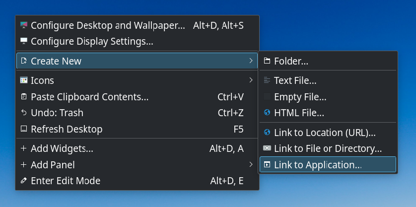
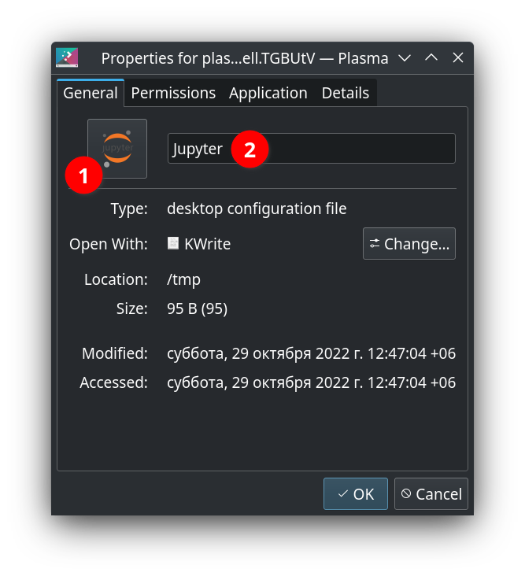
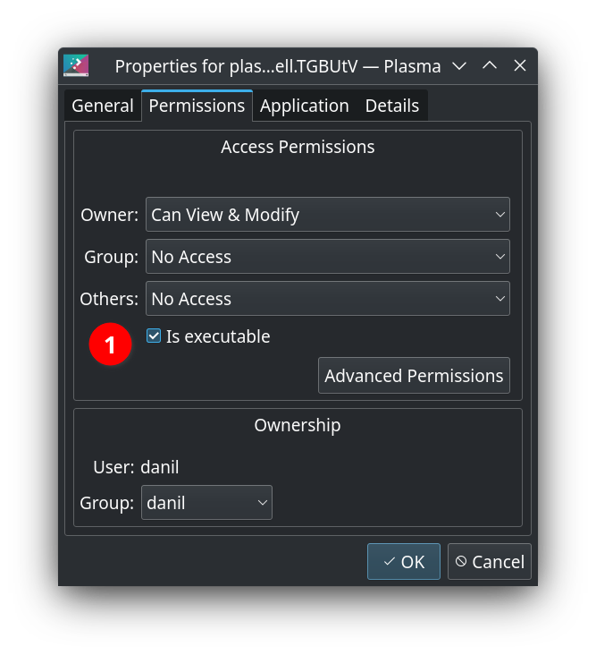
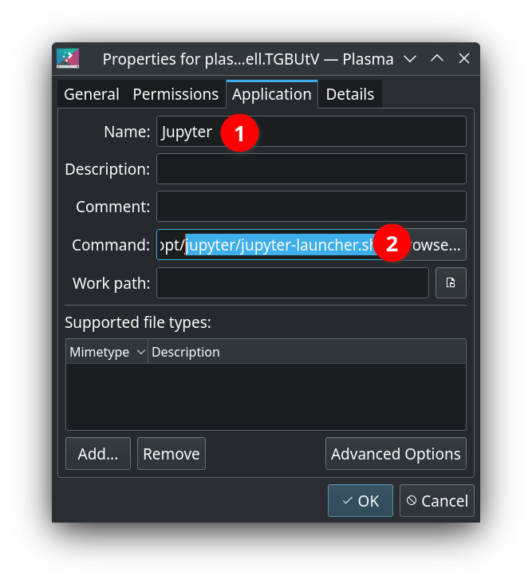
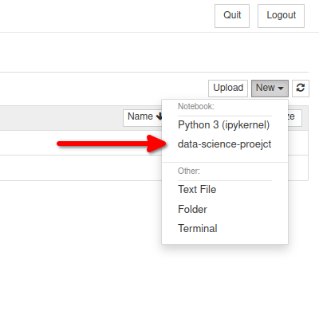

# Jupiter installation instructions
Hi, this is a guide on how to **correct** install Jupiter on your computer. This guide is for Ubuntu users.

Main advantages of this method installation:
- one Jupiter installation for all your projects
- easy swap between different virtual environments

First of all, some usefull links:
- [Jupiter's website](https://jupyter.org/)
- [ Installing the IPython kernel](https://ipython.readthedocs.io/en/stable/install/kernel_install.html)

#### Prerequisites
```bash
sudo apt update
sudo apt install python3 python3-venv
```

#### Jupyter installation
```bash
# jupyter installation
cd /opt
sudo mkdir jupyter
sudo chown -R $USER:$USER jupyter
cd jupyter
sudo python3 -m venv venv
source venv/bin/activate
pip3 install -U pip notebook

# add jupyter-launcher bash script
cd /opt/jupyter
sudo echo "#!/bin/bash
source /opt/jupyter/venv/bin/activate
cd ~
jupyter notebook" >> jupyter-launcher.sh
sudo chmod +x jupyter-launcher.sh

# download Jupyter logo icon
wget -O jupyter-logo.png https://upload.wikimedia.org/wikipedia/commons/thumb/3/38/Jupyter_logo.svg/1200px-Jupyter_logo.svg.png
```

After this, you should have folder structure like this:
```bash
opt/
|__jupyter/
   |__venv/
   |  |__ ...
   |__jupyter-launcher.sh
   |__jupyter-logo.png
```

Adding Jupyter icon to desktop:

| Right click                                  |                                   |                                       |                                       |
|----------------------------------------------|-----------------------------------|---------------------------------------|---------------------------------------|
|  |  |  |  |

#### Registering Jupyter kernel from virtual environment
Assume, you start new data science project. Let`s create virtual environment for it:
```bash
cd ~
mkdir data-science-project && cd $_
python3 -m venv venv
source venv/bin/activate
pip3 install -U pip ipykernel
# register new virtual environment as Jupyter kernel
python3 -m ipykernel install --prefix=/opt/jupyter/venv --name="data-science-project"
```

After this, when you run Jupyter you should see new kernel in the list:



Also, you can check it by running `jupyter kernelspec list` command:
```bash
source /opt/jupyter/venv/bin/activate
jupyter kernelspec list
# or if you want to remove kernel
jupyter kernelspec uninstall data-science-project
```
